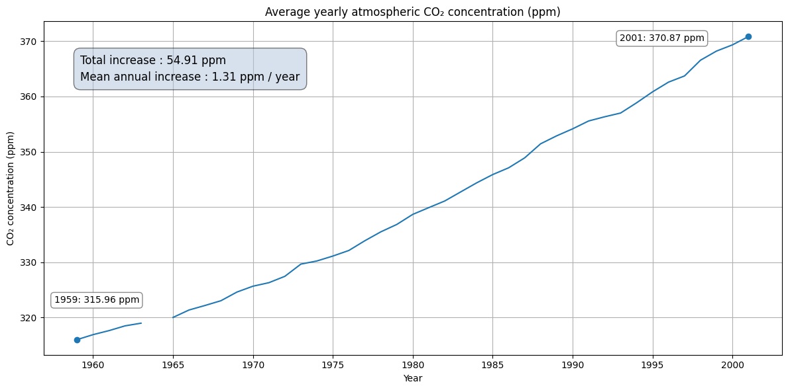

# Mauna Loa Atmospheric CO₂ Analysis

An analysis of the weekly atmospheric CO₂ observations from the Mauna Loa observation site, examining seasonal variability, long-term change in CO₂ concentrations and whether the long-term change follows a linear trend.

This project was completed as preparation for an MSc in Environmental Modelling and Data Analysis at the University of Bristol, with a focus on reactivating practical data analysis skills and developing a more rigorous approach to working with time-series data.

<br>
<p align="center">
  
</p>

## Research Questions

This project aims to answer three questions:

1. Is there evidence of a persistent seasonal cycle in atmospheric CO₂ concentration?
2. How has atmospheric CO₂ concentration changed over time?
3. Is the long-term change in atmospheric CO₂ adequately described by a linear trend?

## Data

The analysis uses the [Mauna Loa atmospheric CO₂ dataset](https://www.statsmodels.org/v0.11.1/datasets/generated/co2.html) that is provided in the package `statsmodels`. The underlying observations are associated with the [NOAA Global Monitoring Laboratory Mauna Loa CO₂ record](https://gml.noaa.gov/ccgg/trends/data.html) from the Global Monitory Laboratory.

The dataset spans from 1958 to 2001 and records the weekly average CO₂ concentrations in parts per million (ppm). The weekly averages are derived from continuous measurements taken four times an hour using a nondispersive infrared gas analyser. 

Before analysis, care was taken to clean the data by assessing the validity of the time series and also examining the distribution of any missing observations. Linear interpolation was used to estimate missing values where appropriate, while certain data was excluded from particular analysis.

## Analysis

Throughout the analysis, the years 1958 and 1964 were excluded. Both contained a large amount of missing observations, and the record for 1958 was incomplete as it started later in the year.

The notebook first examines seasonal variation by computing the average deviation in CO₂ concentration of each calendar month, relative to annual means. The yearly variability is also considered to determine whether the trend  is broadly consistent across the record. 

Next, aggregation through annual means are used to supress the seasonal cycle and thereby quantify the long-term change in atmospheric CO₂ concentration. A simple total growth over the elapsed period is given.

Finally, linear and quadratic regression models are fitted and compared using $R^2$ scores and residual analysis to assess how well they describe the long-term trend. 

## Key Findings
- A clear recurring seasonal cycle was identified, with the mean differences in CO₂ concentration peaking in May and reaching a minimum between September and October. The mean peak-to-trough range of the cycle was approximately 5.56ppm.
- Annual mean atmospheric CO₂ concentration increased from approximately 315.96 ppm in 1959 to 370.87 ppm in 2001, a total increase of approximately 54.91 ppm
- Although a linear model explained a large proportion of the variation in the data, its residuals followed a clear U-pattern consistent with an accelerating rate of growth. A quadratic model reduced this pattern in the residuals, indicating that the long-term trend was not linear.


## Limitations
The record represents a single monitoring location and as such is unable to describe atmospheric CO₂ concentrations globally. In addition to this, the data contains missing values that were interpolated for analysis. 

## Tools

- Python
- pandas
- NumPy
- Matplotlib
- scikit-learn

## Running the Notebook

Install the required packages
```bash
pip install -r requirements.txt
```

Open `mauna_loa_analysis.ipynb` in Jupyter or Google Colab.

